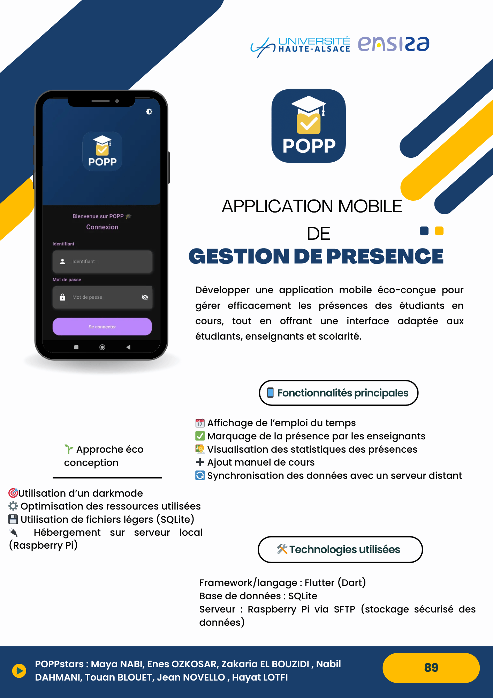

# POPP - Mobile Attendance Management



## Overview
POPP is a complete mobile application for managing student attendance, built with Flutter. It is designed for educational institutions to streamline attendance tracking, reporting, and course management.

---

## Key Features
- **Attendance Management**: Take, track, and export student attendance easily.
- **Course & Session Management**: Create, edit, and view courses and sessions.
- **Statistics**: Visualize attendance and course statistics.
- **User Roles**: Supports admin, teacher, and student roles.
- **Offline Support**: Works seamlessly even without internet.
- **Modern UI**: Intuitive and user-friendly interface.

---

## Documentation
- [User Guide (PDF)](Mode%20d’emploi.pdf)  
  _Comprehensive instructions for using the app._
- [Project Report (PDF)](RapportPOPP.pdf)  
  _Detailed technical and functional documentation._

---

## Getting Started
1. **Clone the repository**
   ```bash
   git clone https://github.com/<YOUR-USERNAME>/<YOUR-REPO>.git
   cd <YOUR-REPO>
   ```
2. **Install dependencies**
   ```bash
   flutter pub get
   ```
3. **Run the app**
   ```bash
   flutter run
   ```

---

## Assets
- **Poster**: `PosterPOPP.png`
- **User Guide**: `Mode d’emploi.pdf`
- **Project Report**: `RapportPOPP.pdf`

---

## Authors
- Zakaria El
- Nabil
- M. Pony

---

## License
This project is for educational purposes.
