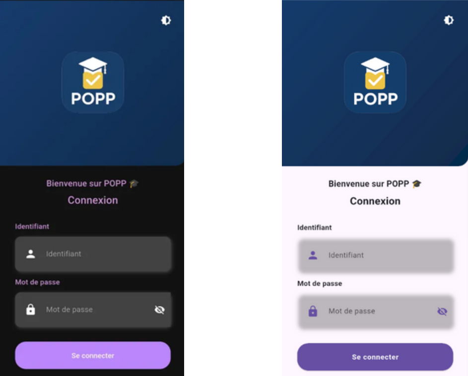
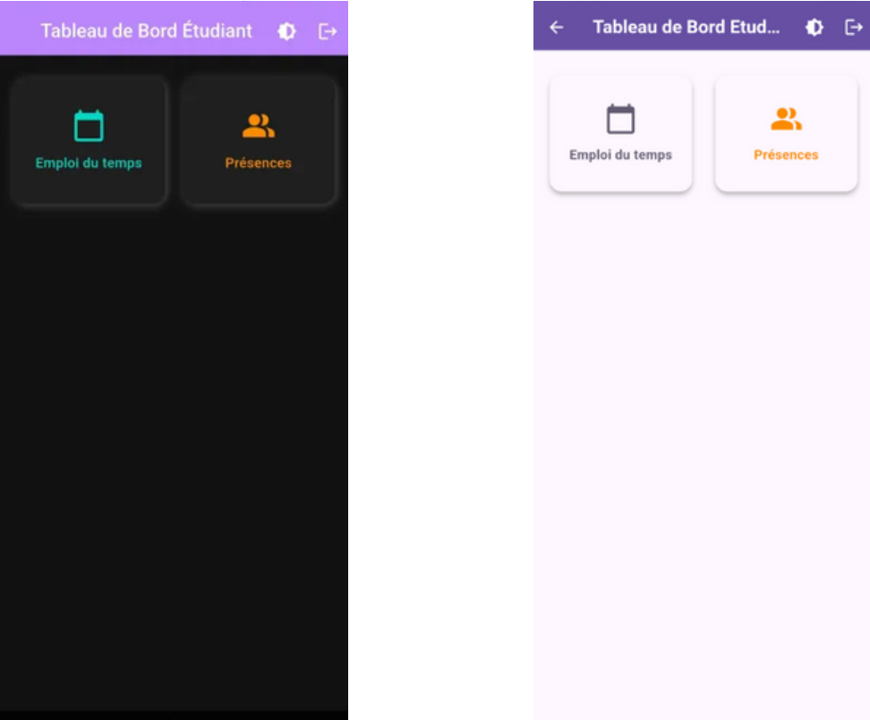
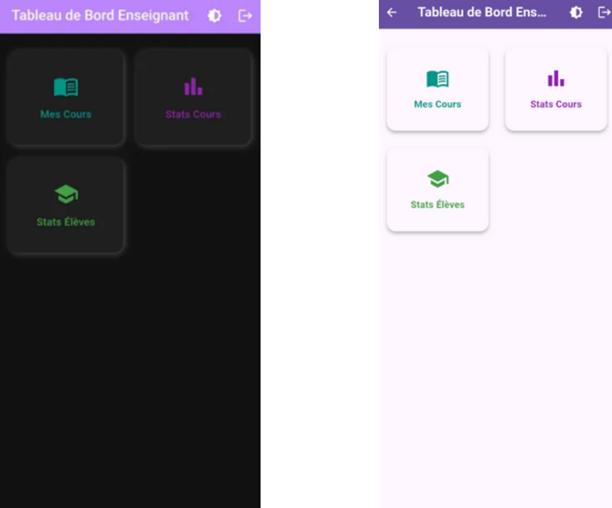
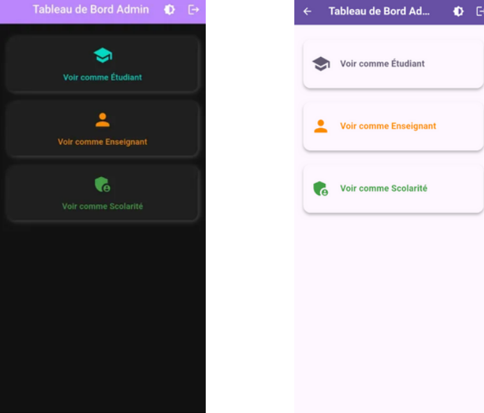
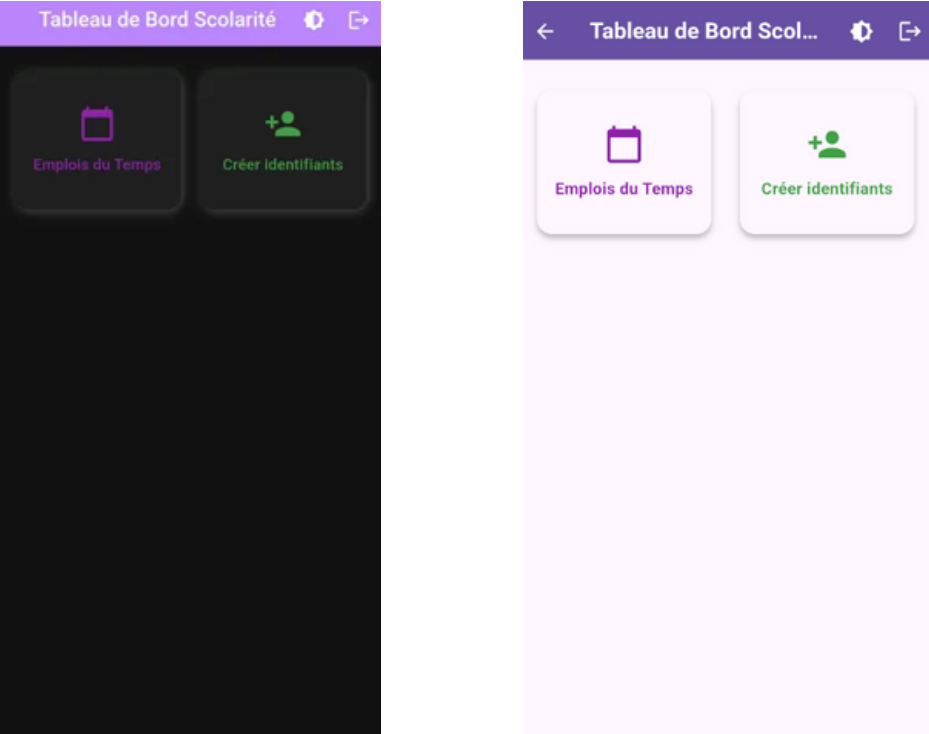
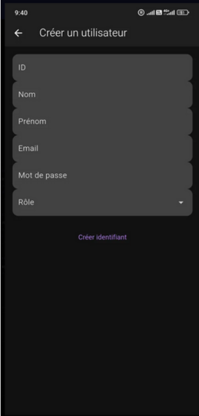
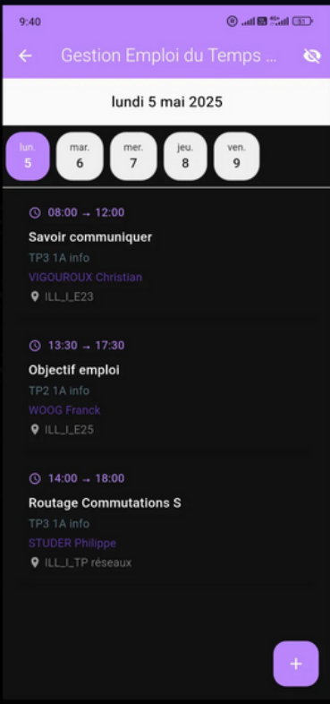
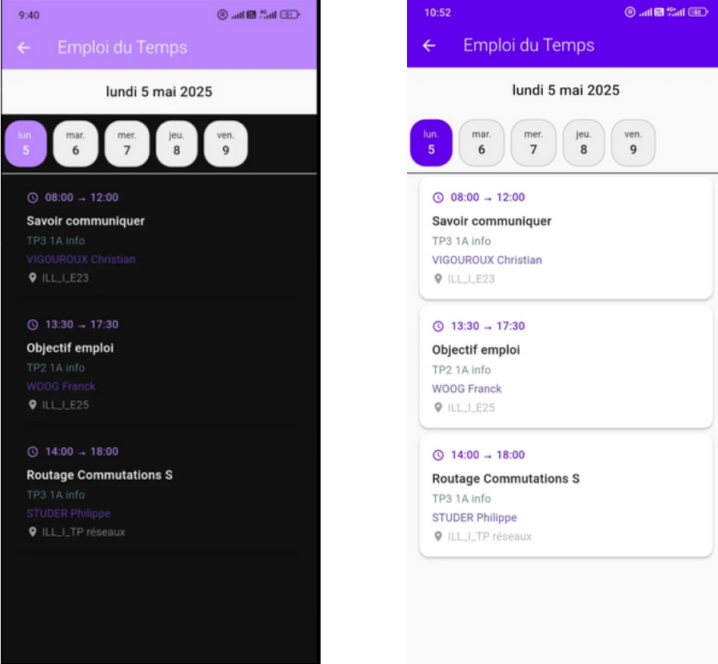
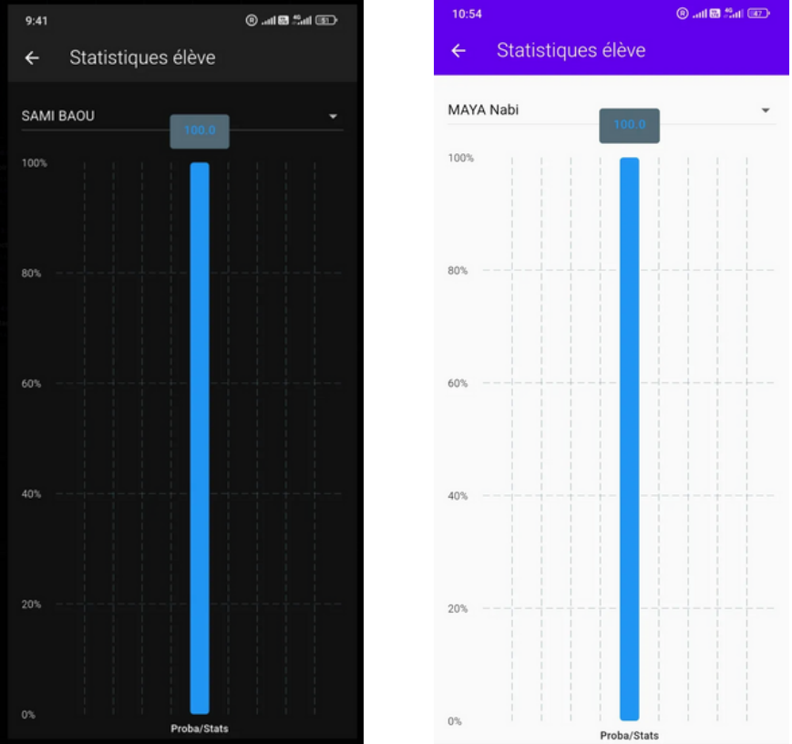

# POPP - Mobile Attendance Management


## Overview
POPP is a complete mobile application for managing student attendance, built with Flutter. It is designed for educational institutions to streamline attendance tracking, reporting, and course management.

---

## Key Features
- **Attendance Management**: Take, track, and export student attendance easily.
- **Course & Session Management**: Create, edit, and view courses and sessions.
- **Statistics**: Visualize attendance and course statistics.
- **User Roles**: Supports admin, teacher, and student roles.
- **Offline Support**: Works seamlessly even without internet.
- **Modern UI**: Intuitive and user-friendly interface.

---

## Screenshots

### 1. Login Page


_Secure authentication screen for all users._

### 2. Student Interface


_Customized view for students: schedule, attendance, and statistics._

### 3. Teacher Interface


_Course management, attendance marking, and quick access to sessions._

### 4. Admin Dashboard


_Global supervision, user and permissions management._

### 5. Registrar Interface


_Advanced schedule management, credential creation, and reports._

### 6. Create Credentials


_Fast addition of new users by the registrar._

### 7. Manage Timetable


_Edit and organize sessions and courses._

### 8. Timetable View


_Clear visualization of the schedule for each user._

### 9. Student Statistics


_Graphical analysis of attendance and performance._

---

## Documentation
- [User Guide (PDF)](Mode%20d’emploi.pdf)  
  _Comprehensive instructions for using the app._
- [Project Report (PDF)](RapportPOPP.pdf)  
  _Detailed technical and functional documentation._

---

## Getting Started
1. **Clone the repository**
   ```bash
   git clone https://github.com/<YOUR-USERNAME>/<YOUR-REPO>.git
   cd <YOUR-REPO>
   ```
2. **Install dependencies**
   ```bash
   flutter pub get
   ```
3. **Run the app**
   ```bash
   flutter run
   ```

---

## Assets
- **Poster**: `PosterPOPP.png`
- **User Guide**: `Mode d’emploi.pdf`
- **Project Report**: `RapportPOPP.pdf`
- **Screenshots**: see `/screenshot/`

---

## Authors
- Maya NABI
- Enes OZKOSAR
- Zakaria EL BOUZIDI
- Nabil DAHMANI
- Touan BLOUET
- Jean NOVELLO
- Hayat LOTFI

---

## License
This project is for educational purposes.
